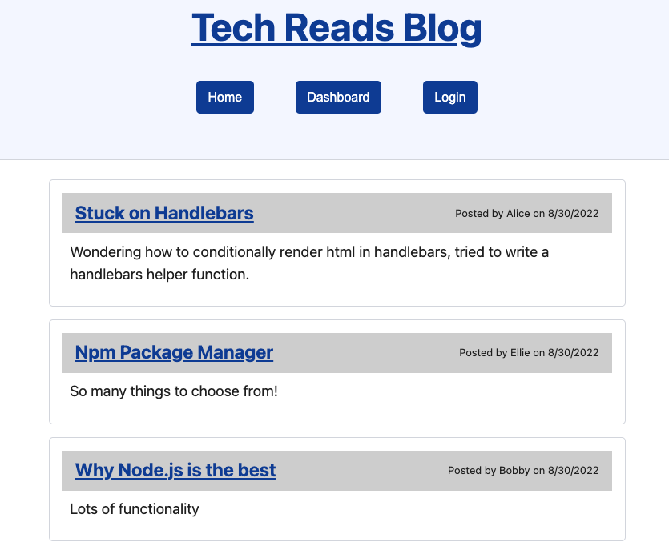
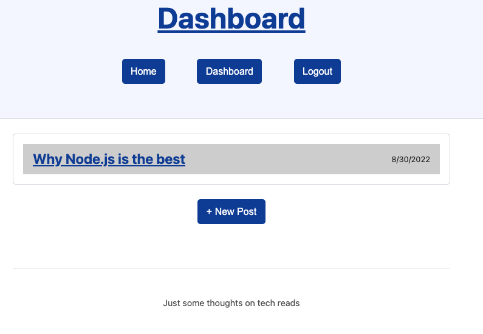
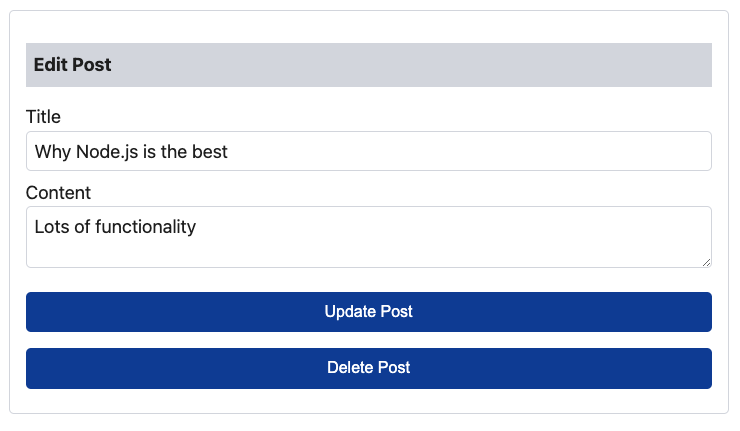

 # Tech Reads Blog

## Description 
A blog where developers can publish and comment on posts.

## Table of Contents
* [Installation](#installation)
* [Usage](#usage)
* [Built With](#built-with)
* [Questions](#questions)

## Installation
~~~
npm i
~~~
## Usage

Open the app on heroku here: https://dry-brushlands-70423.herokuapp.com/
  

## Built With
* Node.js
* Express.js, express-sessions
* Handlebars
* Sequelize
* MySQL2 
* Bcrypt and dotenv
* [Simple CSS](https://simplecss.org/)

## Questions

Contact me at madalyne@madalynecross.com with any questions. View more of my work here: [violanerd](https://github.com/violanerd).

Readme edit for testing